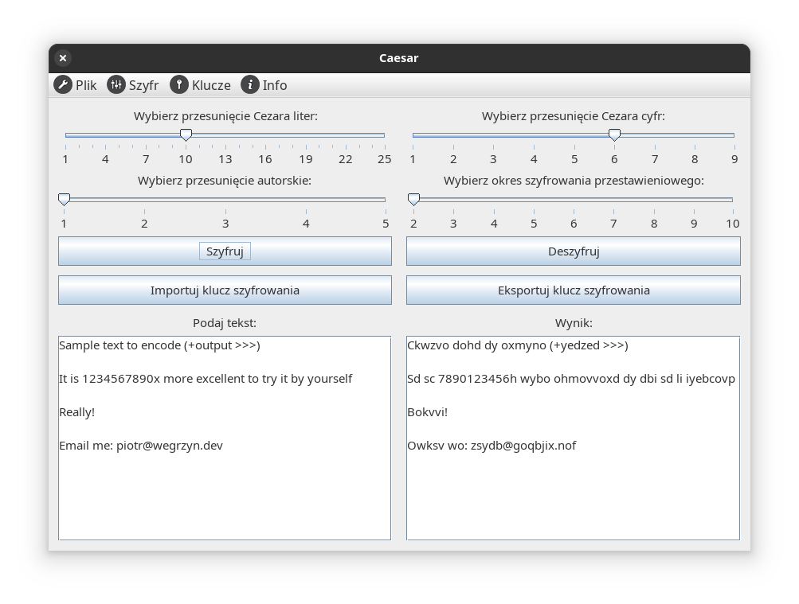

# Caesar

Simple app for encoding and decoding text with different ciphers.


## Features

The app can make an encoding with different method:
* Caesar's cipher (for letters and numbers separately)
* Transposition cipher
* Author's cipher

All of the above might be mixed, additionally with export to and import from file.
The settings also might be exported/imported as `key`.




## Build and run

Caesar is an Ant projest created with NetBeans, so it should work prefectly with it.

If you wish to build with CLI:
```
ant clean jar
```

To run compiled app:
```
java -jar dist/Caesar.jar
```


## License

Icons used within the project are designed by [Dryicons](https://dryicons.com/icon-packs/stylistica-icons-set).

Apart from icons, all the software in this repository is published under GNU General Public License v3. See [LICENSE file](./LICENSE).
